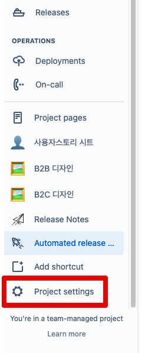
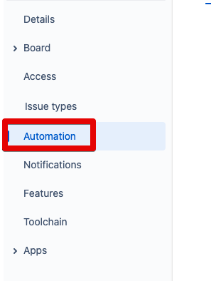
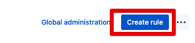
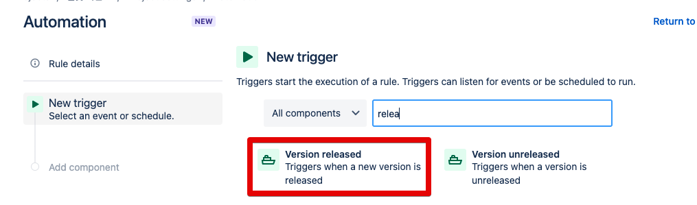
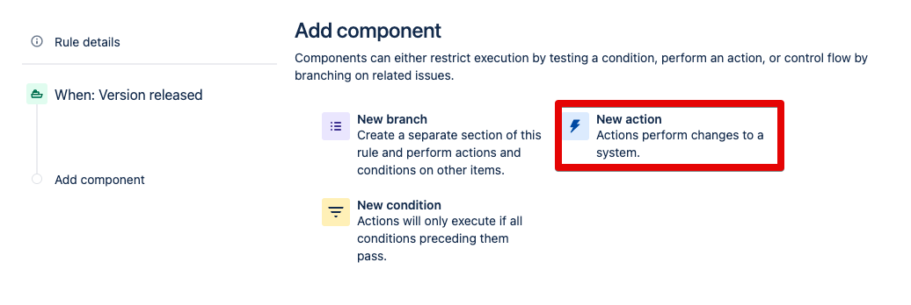
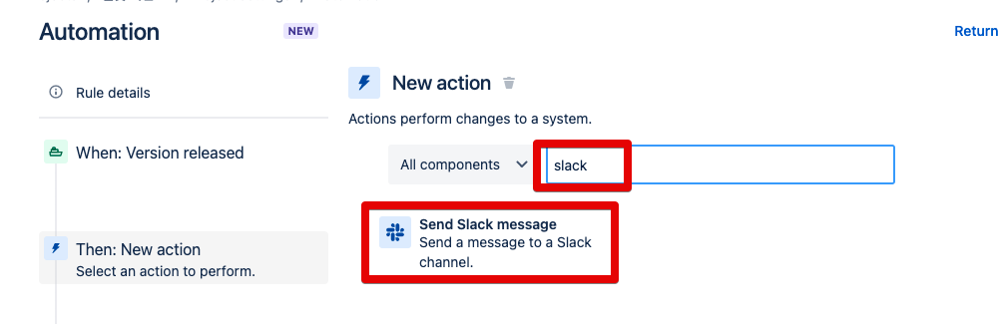
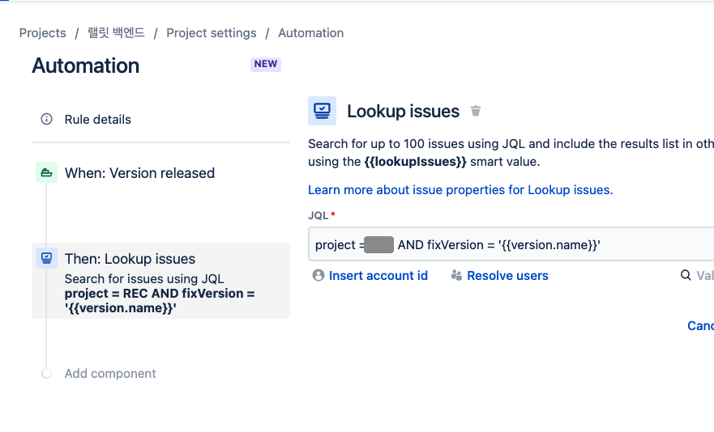
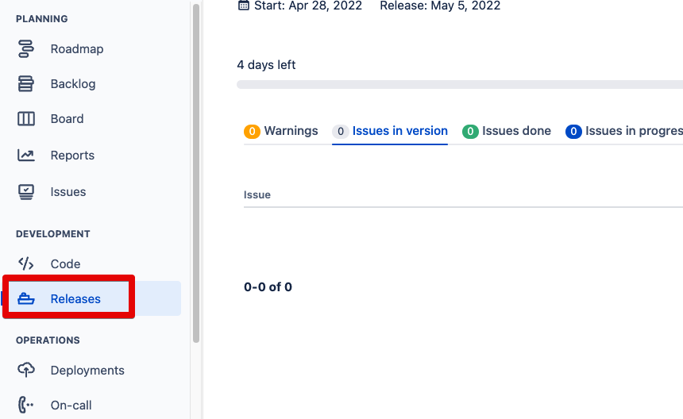
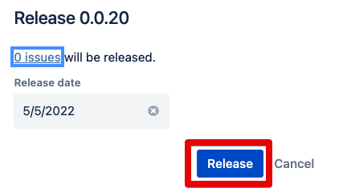
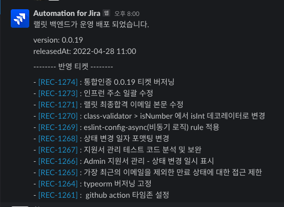

# Jira Release 발생시 Slack에 Release Notes 발행하기

회사 업무를 진행하다보면 매번 자주 하는 작업 중 하나가, 배포공유이다.  
배포가 완료되고, Jira의 티켓들을 Release 하고나면, **어떤 티켓들이 이번에 운영에 배포되었는지를 Slack에 공유**하는 것이다.  
  
매번 하는 것이 귀찮으니, 자동화를 진행할 필요가 있다.

## 1. Jira Rule 생성

Jira에는 **자동화를 지원하는 기능**이 있다.  
[Automation](https://www.atlassian.com/ko/software/jira/features/automation) 이라는 기능인데, Jira의 굉장히 많은 기능들을 **별도의 앱 없이 자동화**를 사용할 수 있도록 한다.  
  
이를 이용하면 Slack / Github / Jenkins 등의 연동을 아주 쉽게 할 수 있다.  
  
이번 글에서도 마찬가지로 Jira Automation을 이용해서 진행한다.  
  
Jira 보드의 좌측에 있는 **Project settings**를 선택한다.



이동된 좌측 사이드바의 **Automation**을 선택한 뒤,



**Create rule**을 클릭한다.



그럼 Automation의 앱을 만들수 있는 페이지로 이동하는데, When (Trigger) -> Then (Action) -> And (Action) 의 템플릿으로 생성이 가능하다.  
  
이 Rule의 트리거는 **Jira Version이 release 되었을때**이니, 이를 새로운 트리거로 등록한다.



해당 트리거가 발생 후, 실행할 행동을 위해 **New action**을 선택한다.



**어떤 Jira 티켓들을 슬랙으로 보낼지** 조회를 할 수 있도록 다음 행동은 **Lookup issues**를 선택한다.  
해당 액션은 **JQL을 통해 티켓들을 가져올 수 있다**.  
이를 통해 **특정 프로젝트의 해당 버전에 해당하는 티켓들만** 가져올 수 있다.



특정 프로젝트의 특정 버전의 티켓들만 가져오기 위해서 다음과 같이 JQL을 작성한다. 




```bash
project = 프로젝트ID AND fixVersion = '{{version.name}}'
```

이렇게 가져온 Jira 티켓들의 정보를 Slack으로 보내기 위해 다음 액션을 선택한다.


Slack 연동은 기본적으로 지원하는 액션이라 바로 Slack 을 검색해서 선택한다.


미리 생성해둔 [Slack 웹훅 주소](https://jojoldu.tistory.com/552)를 등록하고, 다음과 같이 슬랙 메세지를 작성한다.


```bash
운영 배포 되었습니다. 

version: {{version.name}}
releasedAt: {{now.jqlDateTime.convertToTimeZone("Asia/Seoul")}}

-------- 반영 티켓 --------

{{#lookupIssues}}
- <{{url}}|[{{key}}]> {{summary}}
{{/}}
```

미리 정의된 시스템 변수들은 다음의 링크들을 참고한다.

* https://support.atlassian.com/cloud-automation/docs/what-are-smart-values/

이렇게 Rule 생성이 끝났다면 실제로 Jira Release를 진행해본다.

## 2. 최종

Jira의 Release 페이지로 이동한뒤,



이번 배포에 해당하는 내용들을 Release 해보면?



다음과 같이 지정된 포맷대로 Jira 티켓들이 Slack 메세지에 정리되어 공유된다.



## 3. 마무리

여기까지 되었다면, 이후에 본인의 CI환경에 따라 **배포가 완료되면 자동으로 Jira Release가 되도록**하는것도 이어서 할 수 있다.  

* [Jira version Update API](https://docs.atlassian.com/software/jira/docs/api/REST/8.5.4/#api/2/version-updateVersion)
 
이 부분은 각자가 사용하는 CI 환경에 따라 많은 차이가 있어서 (까나리배포를 한다던가, 사용하는 도구가 Jenkins / CircleCI / Github Action 등이라던가) 개별적으로 구현한다.