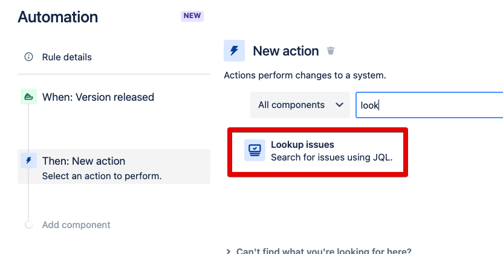
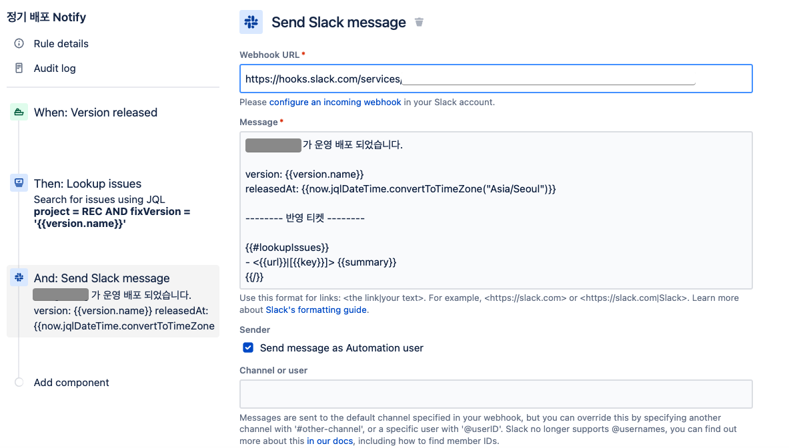

# Jira Release 발생시 Slack에 Release Notes 발행하기








```bash
project = 프로젝트ID AND fixVersion = '{{version.name}}'
```

```bash
시스템이 운영 배포 되었습니다. 

version: {{version.name}}
releasedAt: {{now.jqlDateTime.convertToTimeZone("Asia/Seoul")}}

-------- 반영 티켓 --------

{{#lookupIssues}}
- <{{url}}|[{{key}}]> {{summary}}
{{/}}
```

* https://support.atlassian.com/cloud-automation/docs/what-are-smart-values/

## 최종


